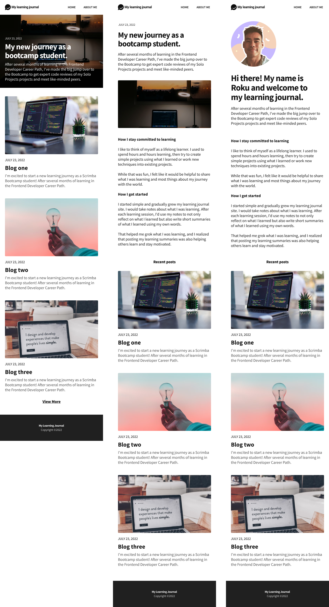

# Scrimba Blog
Scrimba blog project for Module 6 (Responsive Design)

## Design
Mobile Layout:

Desktop Layout:

## Requirements
- Follow design given for mobile and desktop
- Use Flexbox/grid/Media queries to make site responsive